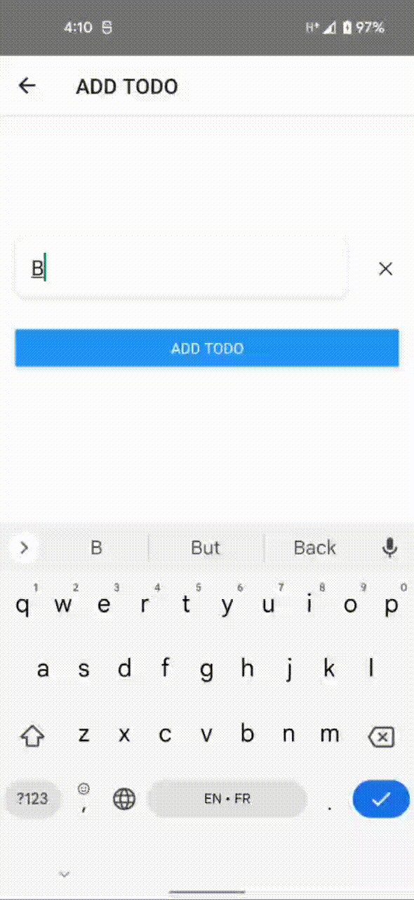

# Homework Module 4 - Third-Party libs

## Description

Integrate camera and geolocation libs into existing todo app

## Acceptance criteria

As a user, I can

 - [x] See markers on map on separate screen when I tap “Markers” button.
 - [x] Attach photo to some task

## Subtasks
 
 - [x] When user create new task, current user location should be stored with this task
 - [x] Create new screen with map where user can see markers where he/she created notes
 - [x] Create new screen where user can take a photo

## Evaluation criteria

 - [x] Task match with all acceptance criteria

 

